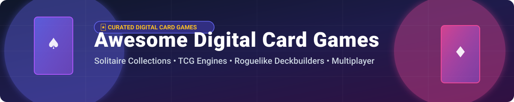

  

# 🃏 Awesome Digital Card Games 🎮

  
  
  
  

> **Curated list of commercial card games, open-source TCG engines, solitaire collections, and roguelike deckbuilders.**

Welcome to the ultimate directory of **digital card games**, **trading card game (TCG) engines**, **solitaire suites**, and **roguelike deckbuilding games**. Whether you are a gamer looking for top-tier competitive card games or a developer searching for open-source card game frameworks, this collection covers the best tools and titles available.

---

## 📖 Table of Contents

- [💼 Commercial Card Games & SaaS Platforms](#-commercial-card-games--saas-platforms)
- [🔓 Open-Source GitHub Projects](#-open-source-github-projects)
- [🤝 How to Contribute](#-how-to-contribute)
- [💖 Support & Sponsorship](#-support--sponsorship)
- [📊 Star History](#-star-history)
- [⚠️ Disclaimer](#-disclaimer)

---

## 💼 Commercial Card Games & SaaS Platforms

> **📊 Market Context & Size**: The global digital card game market is estimated at **$6.2 Billion USD** and is expected to reach over **$11.5 Billion USD by 2030**. The sector is **moderately fragmented**: while dominant franchises (such as *Microsoft Solitaire*, *Pokémon TCG*, and *Hearthstone*) hold significant market share in their respective sub-genres, no single vendor holds a winner-take-all monopoly. Players frequently move across classic solitaire, competitive TCGs, and single-player roguelike deckbuilders.

### 🏆 SaaS & Commercial Game Directory

*Sorted by company revenue / valuation in descending order:*

| Game / Platform | Description | Starting Pricing Tier | Free Tier / Trial Limits | Company Size (Revenue / Valuation) |
| :--- | :--- | :--- | :--- | :--- |
| **[Microsoft Solitaire Collection](https://www.microsoft.com/en-us/p/microsoft-solitaire-collection/9wzdncrfj3tj)** 🃏 | The default Windows solitaire suite featuring Klondike, Spider, FreeCell, Pyramid, and TriPeaks. | **$1.99/month** (Premium Edition) | **Free forever** (Full access to core game modes supported by ads) | **~$281.8B Annual Revenue** (Microsoft FY2025) |
| **[Hearthstone](https://playhearthstone.com/)** ⚔️ | Blizzard's flagship digital trading card game with competitive strategy and seasonal expansions. | **$19.99** (Mega-Bundle / Special Pack Bundles start at $19.99) | **Free forever** (Starter decks, core set, and solo adventures included) | **~$8.7B Annual Revenue** (Activision Blizzard / MSFT) |
| **[Yu-Gi-Oh! Master Duel](https://www.konami.com/yugioh/masterduel/)** 🐉 | Definitive digital edition of the competitive Yu-Gi-Oh! TCG with full card pool and official rules. | **$0.99** (Gem bundles starting at $0.99) | **Free forever** (Solo story mode, starter deck, and daily gem quests) | **~$2.4B Annual Revenue** (Konami Group FY2025) |
| **[Legends of Runeterra](https://playruneterra.com/)** 🛡️ | Riot Games' strategy card game set in the League of Legends universe with deckbuilding mechanics. | **$4.99** (Coins bundle starting at $4.99) | **Free forever** (Full card collection unlocked via weekly vaults and region rewards) | **~$1.5B Annual Revenue** (Riot Games) |
| **[Magic: The Gathering Arena](https://magic.wizards.com/en/mtgarena)** 🪄 | Official digital adaptation of MTG with standard, draft, and historic formats. | **$4.99** (Welcome Bundle) | **Free forever** (15 unlockable starter decks and daily gold quests) | **~$1.1B Annual Revenue** (Wizards of the Coast / Hasbro) |
| **[Gwent: The Witcher Card Game](https://www.playgwent.com/)** 🐺 | Strategic round-based card game originating from The Witcher 3 universe with faction warfare. | **$4.99** (Meteorite Powder / Starter packs from $4.99) | **Free forever** (Starter faction decks and story reward trees) | **~$520M Annual Revenue** (CD Projekt Group) |
| **[Balatro](https://www.playbalatro.com/)** 🃏 | Poker-inspired roguelike deckbuilder where illegal poker hands break game limits. | **$14.99** (One-time purchase) | **Free Trial** (Steam Demo available during Next Fest; 0 days full access limit) | **~$50M Valuation** (LocalThunk / Playstack) |
| **[Slay the Spire](https://www.megacrit.com/)** 🗡️ | Genre-defining single-player roguelike deckbuilder with deep tactical card drafting. | **$24.99** (One-time purchase) | **No free tier** (Requires full purchase) | **~$40M Valuation** (Mega Crit Games) |
| **[Marvel Snap](https://www.marvelsnap.com/)** ⚡ | Fast-paced 3-lane card battler with 6-turn matches and dynamic locations. | **$9.99** (Premium Season Pass) | **Free forever** (Access to Collection Level progression and core game modes) | **~$30M Revenue** (Second Dinner) |
| **[Solitaired](https://solitaired.com/)** 🎴 | Web-based solitaire platform offering over 500 game variants and custom card decks. | **$4.99/month** (Ad-free Premium) | **Free forever** (Unlimited free play on 500+ game variants with ads) | **Private / Bootstrapped ($5M est.)** |

---

## 🔓 Open-Source GitHub Projects

> **⭐ Open-Source Ecosystem**: High-quality open-source card engines, solitaire collections, and roguelike deckbuilders sorted by GitHub Stars_Count (descending).

| Repository & Description | GitHub_Stars |
| :--- | :--- |
| **[PySolFC](https://github.com/shlomif/PySolFC)** 🎴 — **The definitive open-source solitaire collection.** Extended fork of PySol supporting **over 1,200 solitaire card games**. Features custom cardsets, sound effects, unlimited undo, player statistics, hint system, and plugin architecture. *GPL-3.0* |  |
| **[Slay the Web](https://github.com/oskarrough/slaytheweb)** 🌐 — **Browser-based Slay the Spire clone.** Single-player deckbuilding roguelike designed with a **UI-agnostic game engine** built in JavaScript/TypeScript and deployed on Cloudflare. *MIT* |  |
| **[PokerTH](https://github.com/pokerth/pokerth)** ♠️ — **Open-source Texas Hold'em poker client.** Supports online multiplayer lobbies, local network games, and AI opponents with configurable difficulty. *GPL-2.0* |  |
| **[KPatience](https://invent.kde.org/games/kpat)** 🐧 — **KDE's polished solitaire suite.** Features 13 popular Solitaire variants including Klondike, Spider, FreeCell, and Simple Simon with modern visual themes. *GPL-2.0* |  |
| **[Cockatrice](https://github.com/Cockatrice/Cockatrice)** 🪄 — **Open-source virtual tabletop for card games.** Popular multiplayer client for playing Magic: The Gathering and custom TCGs over local networks or servers. *GPL-2.0* |  |
| **[Cardio](https://github.com/ymyke/cardio)** 🐍 — **Open-source roguelike deckbuilder.** Written in Python and inspired by *Inscryption*. Single-player terminal-based card game platform. *GPL-3.0* |  |
| **[AisleRiot](https://gitlab.gnome.org/GNOME/aisleriot)** 🕹️ — **GNOME's classic solitaire suite.** Official GNOME desktop collection offering dozens of classic single-player card variants. *GPL-3.0* |  |
| **[Parlour](https://github.com/braedonsaunders/parlour)** 🃏 — **Deterministic TypeScript card-game engine + playable table.** Browser card games (Blitz/31, Wild) solo vs bots or with friends over a room code — no accounts, no servers. Live at [parlour.cards](https://parlour.cards). *MIT* |  |
| **[Cardinal Codex](https://github.com/Big-Sky-Tech/Cardinal-Codex)** ⚙️ — **Headless deterministic TCG game engine.** Rule definitions in **TOML** with hybrid Rhai scripts. Fully deterministic state machine with complete action telemetry. *MIT* |  |
| **[Scoundrel](https://github.com/Lizzard1123/scoundrel)** ⚔️ — **Dungeon-crawling card game for terminal.** Includes Monte Carlo Tree Search (MCTS) agents and PPO Reinforcement Learning models for AI opponents. *MIT* |  |
| **[LSkat](https://invent.kde.org/games/lskat)** 🇩🇪 — **Digital implementation of Lieutenant Skat.** Two-player tactical card game for human vs AI or local multiplayer. *GPL-2.0* |  |
| **[end_of_eden](https://github.com/BigJK/end_of_eden)** 🌿 — **Console-based roguelike card game.** Slay the Spire-inspired tactical card battler running completely in terminal via Lua. *MIT* |  |
| **[cardstock](https://github.com/mgoadric/cardstock)** 📓 — **Python card game framework.** Jupyter Notebook-compatible engine for modeling, simulating, and playing card games. *MIT* |  |
| **[TCG Engines Framework](https://github.com/TheCardGoat/tcg-engines)** 🛠️ — Modular framework for building custom trading card engines with reference implementations for Lorcana and Gundam. *MIT* |  |
| **[Tarok](https://github.com/mytja/Tarok)** 🃏 — Open-source Tarock card game client supporting WebSocket online play and offline AI bots. *MIT* |  |
| **[SolitaireCG](https://fdroid.gitlab.io/jekyll-fdroid/en/packages/net.sourceforge.solitaire_cg/index.html)** 📱 — Android solitaire collection featuring Klondike, FreeCell, Spider, and Forty Thieves. *GPL-3.0* |  |

---

## 🤝 How to Contribute

Contributions are very welcome! To add a new card game or engine:

1. 🍴 **Fork** this repository.
2. 📝 **Add/edit** entries in `README.md` maintaining table formatting.
3. 🔗 Include game/repo name, official link, Stars_Badge, precise pricing, and concise description.
4. 🚀 **Submit a Pull Request** with a descriptive title.

---

## 💖 Support & Sponsorship

If you found this curated list helpful, please consider supporting the project! Your encouragement keeps this list updated and maintained.

- ⭐ **Star** this repository to increase visibility!
- 🔀 **Fork** and share with fellow card game developers and enthusiasts.
- ☕ **Buy me a coffee**: Support ongoing open-source maintenance via [GitHub Sponsors](https://github.com/sponsors/ishandutta2007).

Thank you for being part of the open-source digital card gaming community! ❤️

---

## 📊 Star History

---

## ⚠️ Disclaimer

- This list is **community-curated** for informational and educational purposes.
- Commercial card games may contain microtransactions, loot boxes, or card pack purchases; please verify terms and ratings before playing.
- All trademarks and brand names belong to their respective owners.
